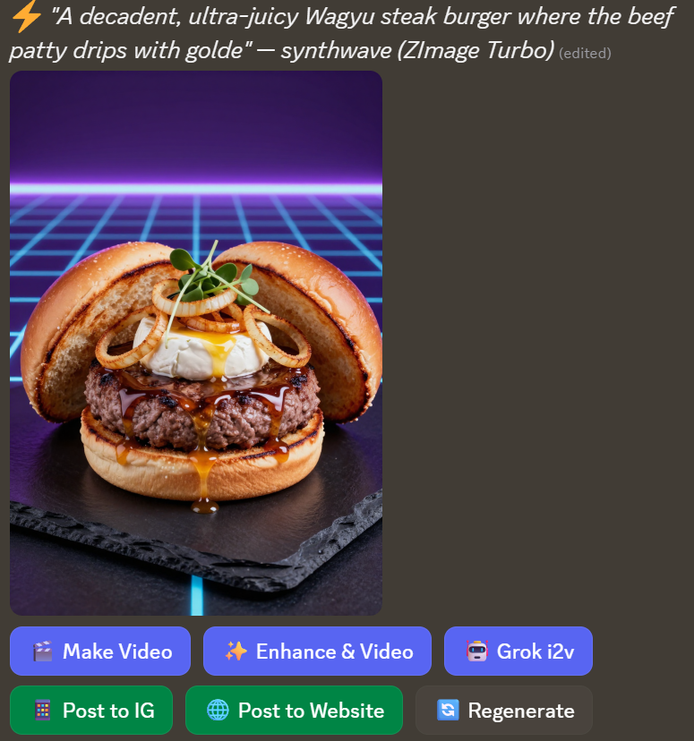
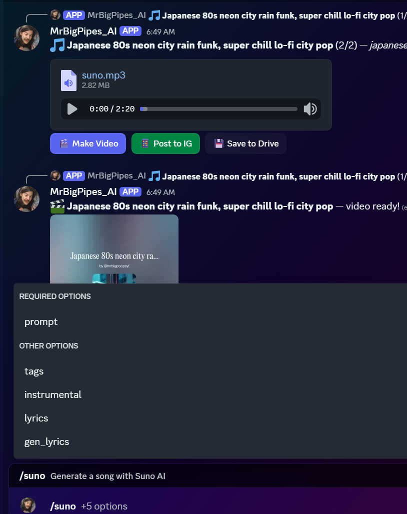
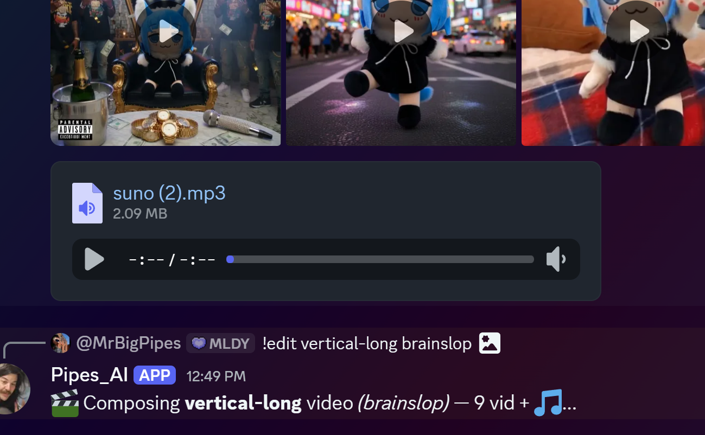

# DiscoClaw

**A multi-agent AI swarm that generates images, video, music, streams to YouTube, posts to Instagram, runs a website, and learns from every interaction — all from Discord.**

DiscoClaw is the orchestration layer that wires [NVIDIA NemoClaw](https://github.com/NVIDIA/NemoClaw) and [HermesClaw](https://github.com/TheAiSingularity/hermesclaw) into a single production system. Four AI agents run inside [NVIDIA OpenShell](https://github.com/NVIDIA/OpenShell) sandboxes on a local GPU, coordinating through Discord to handle every stage of content creation: ideation, generation, editing, publishing, and memory.

It is not a chatbot. It is not a wrapper around one API. It is an autonomous creative pipeline where:

- **Pipes** (team lead) handles 28 Discord commands, generates images/video/music, manages button flows, and runs inside a Landlock+seccomp sandboxed K3s pod
- **Candy** (creative director) reacts to every generation with aesthetic critique, writes captions, and directs style
- **MaoMao** (logic auditor) catches hallucinations, flags bad reasoning, and keeps the crew honest
- **Hermes** (deep research) synthesizes long documents, reviews code, generates media through tool calls, and learns from every tool outcome via its own vector memory

All four agents talk to each other, share memory through Qdrant, and publish to Instagram, YouTube, and Facebook — without any human touching a browser.

<p align="center">
  
  &nbsp;&nbsp;
  
</p>

<p align="center">
  <em>Image gen with button flow &nbsp;&nbsp;·&nbsp;&nbsp; Suno music + video gen</em>
</p>

<p align="center">
  
</p>

<p align="center">
  <em>9-clip video edit with beat-sync, transitions &amp; effects</em>
</p>

## What it does

| Capability | Details |
|-----------|---------|
| **Image generation** | 6 providers: ZImage Turbo (local GPU, 19 styles), Imagen 4 Fast (Google), Grok Aurora (xAI), NVIDIA NIM (SDXL/Flux), Freepik (Kontext Pro), Runware (Kontext Dev) |
| **Video generation** | LTX 2.3 text-to-video (fast 2-pass + standard), image-to-video, first+last frame interpolation, multi-segment story chains, Grok video |
| **Video editing** | Full FFmpeg render engine: 6 presets, 8 styles, 12 crossfade transitions, beat-sync via RMS analysis, Ken Burns, per-segment effects (grain, RGB shift, vignette pulse), lyrics/captions via faster-whisper |
| **Music generation** | ACE-Step (local ComfyUI) + Suno AI v5.5 (custom lyrics, instrumental, gen_lyrics) |
| **Social media** | Instagram (image posts + video reels via Graph API), YouTube (Data API v3 + live streaming + chat bridge), Facebook (Graph API) |
| **Deep research** | Hermes agent: grounded search, arxiv, GitHub inspection, long-context synthesis, code review |
| **Memory** | Qdrant vector DB with per-user + global recall, cross-agent shared knowledge, Hermes learning memory, Google Drive backup every 5 min |
| **Website** | [PIPEBOX](https://drivenemo.web.app) — Next.js 15, Holo-Diamond TCG, CRT Vault, AI gallery with dithering, retro themes |
| **Crew system** | Conditional multi-agent reactions: Pipes responds, Candy + MaoMao react in parallel, skip factual/short messages |

## Architecture

```
Windows 11 + RTX 5080 (16 GB VRAM)
│
├── ComfyUI :8188 ─── image / video / music gen (GPU-bound)
│
└── WSL2 Ubuntu
    │
    ├── PM2 (12 processes)
    │   │
    │   ├── discord-bridge.js ── Pipes_AI gateway (:9339 :9340 :9341)
    │   │   │                    28 slash commands, buttons, crew reactions
    │   │   │
    │   │   ├── candy.js ─────── Mistral Large 3 via NVIDIA NIM (:7701)
    │   │   ├── maomai.js ────── Qwen 3.6+ via OpenRouter (:7702)
    │   │   └── grok-server.js ─ Playwright headless Grok Aurora (:3091)
    │   │
    │   ├── hermes-bridge.js ─── Hermes gateway (:9350)
    │   │   │                    /ask endpoint, /generate tools, file upload
    │   │   │
    │   │   ├── hermes-inference.js ── OpenAI → Vertex AI Gemini (:9351)
    │   │   │                          context caching, agentic tool loop
    │   │   │                          hermes_memory (learns from tool outcomes)
    │   │   │
    │   │   └── hermes-mcp.js ──────── MCP server (:9360)
    │   │                              17 tools: gen, post, search, stream
    │   │
    │   ├── memory-server (:7338) ──── Qdrant MCP, shared crew memory
    │   ├── monitor.js (:7337) ─────── web dashboard
    │   └── agent-watchdog.sh ──────── 3-min healthcheck
    │
    └── Docker Desktop
        │
        ├── Redis :6379 ─── pub/sub (ai:events, ai:help-wanted, ai:teaching)
        │
        ├── Qdrant :6333 ── vector DB (nemoclaw_memory, hermes_memory, shared_knowledge)
        │
        ├── K3s cluster
        │   └── OpenShell sandbox pod (Landlock + seccomp + netns)
        │       └── Pipes_AI agent ── network-isolated, fs-controlled
        │           ├── SOUL.md (persona)
        │           ├── policy.yaml (allowlist)
        │           └── custom skills
        │
        └── hermesclaw container (debian + hermes-agent)
            2 CPU / 4 GB RAM limits, fallback for agentic tasks
```

## Discord Commands (28)

| Command | What it does |
|---------|-------------|
| `/chat` | Talk to Pipes (sandbox agent) |
| `/grok` | Text-to-image via Grok Aurora (xAI) |
| `/grok-img2img` | Upload image, get AI variations |
| `/grok-img2vid` | Upload image, animate it |
| `/imagine` | Text-to-image via Imagen 4 Fast (Google) |
| `/zturbo` | Text-to-image local GPU (19 styles, ~10s) |
| `/video` | Text-to-video via LTX 2.3 |
| `/combi` | First + last frame video (2 images) |
| `/story` | Multi-segment chained story video |
| `/music` | Generate song via ACE-Step (local) |
| `/suno` | Generate song via Suno AI (v5.5, lyrics, instrumental) |
| `/combine` | Replace video audio track |
| `/edit` | Compose video (6 presets, 8 styles, beat-sync, lyrics) |
| `/edit-add` | Add media to edit queue |
| `/edit-go` | Render edit queue |
| `/edit-queue` | Show edit queue |
| `/edit-clear` | Clear edit queue |
| `/capcut` | Video with effects & transitions |
| `/create` | Media picker: type + model + params |
| `/create2` | YouTube stream + IG poster + Breakroom |
| `/post` | Post last media to Instagram / YouTube |
| `/yt` | Search YouTube channel videos |
| `/transcript` | YouTube video transcript + summary |
| `/analyze` | Batch analyze channel streams |
| `/ask` | Grounded doc search (Vertex AI) |
| `/model` | Show current models |
| `/queue` | ComfyUI render queue status |
| `/help` | Show all commands |

### Button flows

Every generation spawns context-aware buttons:

- **Image:** Regenerate, Enhance, Img2Img, Make Video, Grok I2I, Grok I2V, Post IG
- **Video:** Regenerate, Chain, Chain+Prompt, Chain+Enhance, GIF, Post IG, Post YT, Stitch All
- **Grok:** Select 1-4, Regen, Img2Img, Img2Vid, Edit, Video, Post, Back
- **Music:** Suno Video, Post Music
- **GIF:** Loop, GIF→MP4, Post IG Image, Post IG Reel
- **Enhance flow:** Enhanced / Original / Cancel (LLM prompt comparison)

## The crew

| Agent | Model | Provider | Role |
|-------|-------|----------|------|
| **Pipes** | Gemini 2.5 Flash | Vertex AI | Team lead. 28 commands, all generation, sandbox agent, button flows |
| **Candy** | Mistral Large 3 | NVIDIA NIM | Creative director. Aesthetic critique, captions, style direction |
| **MaoMao** | Qwen 3.6+ | OpenRouter | Logic auditor. Catches errors, flags hallucinations, cat energy |
| **Hermes** | Gemini 2.5 Flash | Vertex AI | Deep research. Synthesis, code review, tool-calling with learning memory |

Crew reactions fire after Pipes responds. Candy and MaoMao react in parallel. Skips factual lookups, YouTube queries, and short messages.

## Inference stack

| Layer | Details |
|-------|---------|
| Primary LLM | Gemini 2.5 Flash (Vertex AI, service account OAuth2) |
| Fallback | Mistral Large 3 675B via NVIDIA NIM (on Gemini 429) |
| Candy | Mistral Large 3 (NVIDIA NIM) |
| MaoMao | Qwen 3.6+ (OpenRouter, reasoning enabled) |
| Hermes | Gemini 2.5 Flash (Vertex AI, context caching, 30min TTL) |
| Gemini proxy | Port 9340 — OpenAI-to-Vertex translation |
| Embeddings | gemini-embedding-001 (3072-dim) |
| Cost optimization | Vertex context caching — 75% reduction on repeated system prompts |

## Memory system

- **Qdrant** vector DB (port 6333) with 3 collections: `nemoclaw_memory`, `hermes_memory`, `shared_knowledge`
- **`[REMEMBER:]` tokens** in any agent response store per-user memories
- **Pre-message recall** merges user-specific + global context before every LLM call
- **Hermes learning** stores tool success/failure outcomes, injects past experience on future requests
- **Google Drive backup** every 5 minutes
- **MCP server** (port 7338) exposes memory to Claude Code and external tools

## Social media

| Platform | What |
|----------|------|
| **Instagram** | Image posts via Google Drive + Graph API. Video reels via Catbox + Graph API. Auto-upload for files >8MB |
| **YouTube** | Data API v3: search, transcripts, batch analysis, live streaming, chat bridge to Discord, scene transitions |
| **Facebook** | Graph API posting |

Owner-gated. No accidental posts.

## Security

- All secrets in `~/.nemoclaw_env` (gitignored, never committed)
- No hardcoded credentials, user IDs, or server IDs in this repo
- Sandbox agent isolated via OpenShell (Landlock + seccomp + network namespace)
- Hermes container: 2 CPU, 4 GB RAM resource limits
- Owner-gated social posting and admin commands
- Rate limiting: 7 video gens/hr per user, 20 Hermes requests/hr per user

## Hardware requirements

- **GPU:** NVIDIA RTX with 16GB+ VRAM (tested on RTX 5080)
- **OS:** Windows 11 with WSL2 + Docker Desktop
- **RAM:** 32GB+ recommended
- **Runtime:** Node.js 22, PM2, FFmpeg, Playwright, faster-whisper

## Install

```bash
# 1. Install upstream frameworks
git clone https://github.com/NVIDIA/NemoClaw  ~/.nemoclaw/source
git clone https://github.com/TheAiSingularity/hermesclaw  ~/hermesclaw

# 2. Clone DiscoClaw
git clone https://github.com/dknos/DiscoClaw  ~/discoclaw
cd ~/discoclaw

# 3. Run installer (creates symlinks; existing files get .bak)
bash install.sh

# 4. Add secrets to ~/.nemoclaw_env
# Requires: DISCORD_BOT_TOKEN, HERMES_DISCORD_TOKEN, HERMES_GCP_PROJECT,
# HERMES_GCP_SA_KEY, NVIDIA_API_KEY, OPENROUTER_API_KEY, SUNO_COOKIE,
# INSTAGRAM_ACCESS_TOKEN, YOUTUBE_API_KEY, etc.

# 5. Start
bash ~/start-both.sh    # NemoClaw + HermesClaw, crash-isolated
```

## Health checks

```bash
pm2 list                                       # all processes
docker ps                                      # all containers
curl -s http://127.0.0.1:9351/metrics | jq     # Hermes inference stats + cost
curl -s http://127.0.0.1:9351/health           # inference shim
curl -s http://127.0.0.1:9350/health           # hermes bridge
curl http://172.20.224.1:8188/queue             # ComfyUI render queue
```

## Built on

- [NVIDIA NemoClaw](https://github.com/NVIDIA/NemoClaw) — OpenClaw agent sandbox orchestration (Apache 2.0)
- [NVIDIA OpenShell](https://github.com/NVIDIA/OpenShell) — Landlock/seccomp/netns container isolation
- [HermesClaw](https://github.com/TheAiSingularity/hermesclaw) — Hermes agent framework (MIT)

Custom integration, agent orchestration, and all bridge code by [dknos](https://github.com/dknos).

## License

Apache 2.0 — see [LICENSE](LICENSE)
